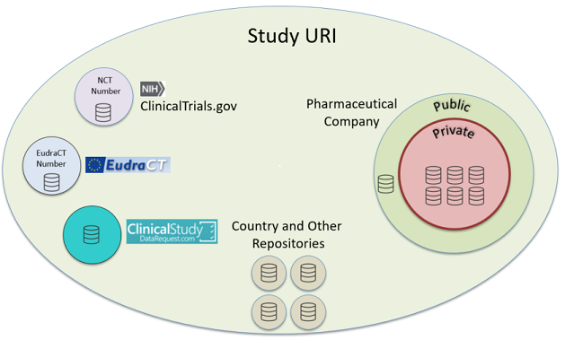
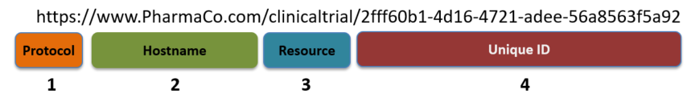

--- ***NOTE: DRAFT under heavy revision *** ---

# Prologue
This is a working draft proposal for creation, management, and use of Uniform Resource
Identifiers (URIs) for clinical trial identification. The work was inspired by the
PhUSE EUConnect18 paper "Study URI" [[Paper]](http://www.phusewiki.org/docs/Frankfut%20Connect%202018/TT/Papers/TT10-tt09-study-uri-19746.pdf) [[Presentation]](http://www.phusewiki.org/docs/Frankfut%20Connect%202018/TT/Presentations/TT10-tt09-study-uri-pub-19747.pdf) by Kerstin Forsberg
and Daniel Goude. These recommendations are under development and subject to change.

You may contribute to this project by branching the Github repository. Please
send comments and feedback by raising a Github *issue*. Open questions for team meetings are [here](StudyURI-questions.md)

## Introduction
The concept of unique identifiers for clinical trials is not new, but implementations are inconsistent and subject to change over time. The **NCT Number**, commonly referred to as the **ClinicalTrials.gov identifier**, is one of the most widely recognized study identifiers [[ClinicalTrials.gov]](https://clinicaltrials.gov/). This number is created after submission and review of the protocol at ClinicalTrials.gov, so it is not available earlier in the development process. The European Medicines Agency provides the capability to generate unique identifiers for trials, called the **EudraCT number**, which can be used to look up information in the [European Clinical Trials Database(EudraCT)](https://eudract.ema.europa.eu/). There are also repositories for specific countries, as well as multiple databases within the pharmaceutical companies themselves.There is no consistent way to bring this information together for patients, researchers, or regulatory organizations.

Historically, development of identifiers was driven by the need to identify trials in specific repositories, with the hope of leading to broader usage and application. Unfortunately, no one standard exists. Multiple repositories contain different types of information about the same trial, and companies maintain their own public and private information.

The use case for identifiers has progressed beyond the need for locating information within a company or repository. Web-based identifiers (URIs) can provide the required unique identifier while also facilitating links between repositories (both public and private) and also serving as a mechanism to surface information about that resource. This multiple  functionality greatly enhances the utility of identifiers that use this approach.

**Figure 1:** Use of Study URI to join information across disparate sources.

Searching for information about clinical trials on the the web is now commonplace for both patients and researchers. In fact, patients and the general public have come to *expect* this information is available online. Without a common identifier, multiple searches must be executed using  synonyms (codes, numbers, acronyms) for the same trial. For example: `D3562C00096`, `4522IL/0096`, `NCT00240331`, `2004-001741-15`and `AURORA` all refer to the same study. Data must be merged from different systems that use these acronyms, often relying in free text fields for study codes and acronyms. Current expectations for ease of access to this information are not being met.

Multiple, inconsistent acronyms and synonyms complicate obtaining information from 
public data request portals such as https://www.clinicalstudydatarequest.com
and https://astrazenecagroup-dt.pharmacm.com  Clinical studies are key entities
over time, as study data can be of renewed interest in collaborative research
projects years after the study was conducted. This is a challenge in a changing
pharmaceutical landscape where companies merge, and medical products are
divested and acquired. Meanwhile, the operating models within companies change,
systems are upgraded, information is migrated, and coding standards change. As a
result, multiple identifiers become associated with a single study. Some
identifiers are public, such as registry IDs and the identifiers assigned by
regulatory authorities. Others are internal, such as the codes and acronyms
used by sponsors. Some of the study codes are a consequence of different code
standards. Different code standards can be seen as a representation of the
history of the investigated medical product and of the sponsor company.

# Study URI 

## Requirements

Any solution must address the multiple challenges surrounding clinical trial identifiers, including bridging of information between  multiple repositories, multiple and consistent synonyms, and difficulty with look ups. To overcome these challenges, clinical trials require identifiers that are: 

* Unique 
* Easy to create and use
* Machine-readable, without human interpretable meaning (which is open to misinterpretation and change)
* Stable and immutable over time 
* Linkable to other online repositories, including public and private information about the study. 
* Linkable to human-interpretable identifiers and metadata
* Available prior to submission of protocols while ensuring uniqueness in the absence of a central authority.

## URIs

A "Uniform Resource Identifier (URI) is a string of characters that unambiguously identifies a particular resource" [[Wikipedia]](https://en.wikipedia.org/wiki/Uniform_Resource_Identifier), where a "resource" is any entity or thing you wish to describe or identify (including clinical studies!) URIs follow a set of rules to maintain their uniformity.
They look a lot like the familiar Uniform Resource Locator (URL) because they use either http or https as their protocol. In fact, URI is a broader term that includes both URLs and Uniform Resource Names (URNs), but this is more detail than is necessary for the discussion here. For more on this topic see [W3C Note 21](https://www.w3.org/TR/uri-clarification/).

Even though URIs use the http protocol, this does not mean their use is restricted to the web. URIs are well suited for assigning a globally unique and definitive identifiers both on the internet and within private networks and databases. When care is taken to use unique identifier (such as a [UUID](https://en.wikipedia.org/wiki/Universally_unique_identifier), URIs can be used to uniquely identify distinct entities, like different clinical studies.

Use of the http protocol enables URIs to retrieve information about a resource, much as you would use a URL to return a web page of information about a topic. URIs can function both as **unique identifiers** and as a mechanism for **information retrieval**.

## URI Structure

[Uniform Resource Identifiers](https://en.wikipedia.org/wiki/Uniform_Resource_Identifier) (URIs) as [Resource Description Framework](https://en.wikipedia.org/wiki/Resource_Description_Framework) (RDF) is an ideal candidate for clinical trial identifiers. By definition, they can be used to unambiguously identify a resource and are a well-established [W3C standard](https://www.w3.org/wiki/URI).

The proposed Study URI is composed of four components: *Protocol*, **HostName**, **Resource Type**, and the **Unique Identifier**.

**Figure 2:** Study URI structure.

### 1. Protocol
Protocol can be either `hhtp` or `https`.  The "s" in `https` indicates that a secure, encrypted connection is desired. Because one  of the goals of Study URI is retrieve information about a study from online sources, `https` is the recommendation from this project. See [HTTPS and the Semantic Web/Linked Data](https://www.w3.org/blog/2016/05/https-and-the-semantic-weblinked-data/) for more information.

* Recall that use of https does not mean data has to be available on the internet or accessed by a web browser.This type of identifier can be used in databases behind company firewalls and do not require http services to make use of the data. 

### 2. Hostname
Internet hostnames are a combination of the host's local name and its parent domain. For example www.PharmaCo.com is a combination of the local web server name `www` with `PharmaCo.com` as the parent domain. Once again, there is no implication that, during development, these URIs need to resolve to values inside or outside of the company creating or responsible for the data [see [Resolving URIs](#ResolvingURIS)] later in this document. For development purposes, the hostname `www.example.org` is often used.

Hostnames are subject to change over time and may represent different entities and use cases.

| Hostname  | Description                                                     |
|-----------|-----------------------------------------------------------------|
| www.PharmaCo.com   | Publicly available information about the study at the "PharmaCo" company web site |
| www.PharmaCo.net   | Information available within the "PharmaCo" company firewall |
| www.RepoAuth.org   | Information at a specific repository (e.g.: clinicalTrials.gov, EudraCT, or others ) |

### 3. Resource Type
We recommend the use of *clinicaltrial* for the resource type for clear identification of the type of resource represented. Resource type is *case sensitive*. 

### 4. Unique ID
The Unique ID is a critical component because it serves as the unique identifier. It must satisfy the aforementioned ID Requirements listed in this document.  [Unique ID Creation: Technical Details](./UUIDTechDetails.md) provides the technical details necessary for creating a Unique ID using one of four possible methods. Examples on this page make use of the ID value created as a UUID generated using Method 1 or Method 2. 

### Alternative for Discussion 2019-03-27

Wikidata Q Number

[https://www.wikidata.org/wiki/Q4654994](https://www.wikidata.org/wiki/Q4654994)

## Implications of the URI structure
Following the prescribed  syntax of the Study URI means that the Unique Identifier can remain stable over time while the other components may change (Protocol, Hostname, Resource) based on context or change in meaning.

*add more information and context here *

## Recommended Predicates
*Section under development.*

| Predicate            | Object Description   |
| ---------------------|:-------------:|
| hasEudraCTID         | EudraCT ID number.  | 
| hasNCTID             | ClinicalTrials.gov ID (NCT number)   |
| hasUUID              | UUID used to form Study URI 
| hasUUIDCreateDate    | Date UUID created
| hasUUIDCreateMethod  | Method used to generate UUID
| hasCompanyID         | Company identifiers  |
| hasCompanyAcronym    | Company acronyms |

## Resolving URIs 

***Section to be developed***

Add information on:

*Internal versus External Resolution
* Retrieving information related to the study (e.g. Protocol) using fragment identifiers (#) or key=value pairs.

## Examples
*Section to be developed*

## Use Cases
*Section to be developed*

## Governance
A central organization is needed to create study URIs, ensure their uniqueness, and make them available.

## References
[Cool URIs for the Semantic Web](https://www.w3.org/TR/cooluris/)
Study URI" [[Paper]](http://www.phusewiki.org/docs/Frankfut%20Connect%202018/TT/Papers/TT10-tt09-study-uri-19746.pdf) [[Presentation]](http://www.phusewiki.org/docs/Frankfut%20Connect%202018/TT/Presentations/TT10-tt09-study-uri-pub-19747.pdf)

"Study URI" [[Paper]](http://www.phusewiki.org/docs/Frankfut%20Connect%202018/TT/Papers/TT10-tt09-study-uri-19746.pdf) [[Presentation]](http://www.phusewiki.org/docs/Frankfut%20Connect%202018/TT/Presentations/TT10-tt09-study-uri-pub-19747.pdf)

## Contributors
    - Kerstin Forsberg (AstraZeneca)
    - Daniel Goude (AstraZeneca)
    - Nolan Nichols (Genentech)
    - Johannes Ulander (A3 Informatics)
    - Tim Williams (UCB Biosciences)
