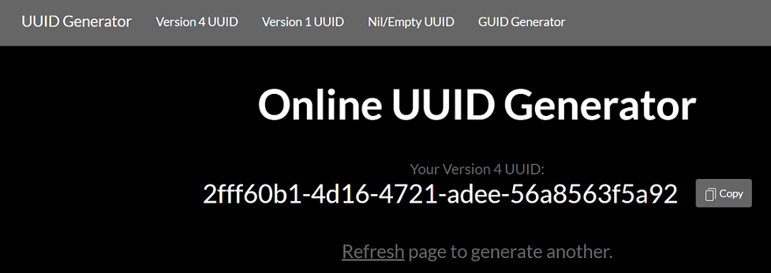

# Methods to Create Unique Identifiers <a name="top"></a>
This page outlines four possible methods for creating the ***Unique Identifier** portion of the Study URI, with pros and cons for each. All methods use the fictional company "PharmaCo.""
Any of the methods can be used independently to generate a unique identifier. R code in the examples can be substituted with other languages where appropriate.

1. [Online UUID](#OnlineUUID)
2. [Programmatic UUID](#ProgrammaticUUID)
3. [Hash Study Title](#HashStudyTitle)
4. [Encode Study Title](#EncodeStudyTitle)

All methods place the identifier within the URI path instead of using a fragment identifier (#). This facilitates later extension to passing optional qualifiers to extract information related to the study identifier by processing this information (including key=value pairs) the server side. Fragment identifiers (#) are processed entirely on the client side and are not processed on the server side.


## Method 1:  <a name="OnlineUUID"></a>Online UUID Generator
This method relies on an online UUID generator and has no dependency on the study title or other study data or metadata. Several online UUID generators are available and the one chosen here is for example purposes only. 

Example: `https://www.PharmaCo.com/clinicaltrial/2fff60b1-4d16-4721-adee-56a8563f5a92`


Steps:

1. Browse to the online UUID generator https://www.uuidgenerator.net/
2. Generate a UUID. 
 
3. Copy the UUID
`2fff60b1-4d16-4721-adee-56a8563f5a92`
4. Create the URI by concatenating the *Namespace*, *Resource type*, and *UUID*.
`https://www.PharmaCo.com/clinicaltrial/2fff60b1-4d16-4721-adee-56a8563f5a92`

Pros:  

* Ease of creation

Cons:  

* Not reproducible
* Cannot decode value back to original source
* Does not scale. This manual method is more labor-intensive than programmatic methods
* Susceptible to copy-paste errors.

[Back to top](#top)

## Method 2: <a name="ProgrammaticUUID"></a>Programmatic UUID Generator

This example uses the R package `uuid` to programatically create UUIDs. Other languages can be used in a similar fashion. Code concatenates the generated UUID with a specified *Namespace* and *Resource Type* to create a URI for study. The UUID is different each time the code is run. 

Example: `https://www.PharmaCo.com/clinicaltrial/3ddf3c44-36b9-11e9-a4c9-c9e469aa18e6`

Steps:

Create a program that:
1. Generates a UUID. 
2. Concatenates the *Namespace*, *Resource Type*, and *UUID*.

Example R Code:

```
# Create Study URI from rogrammatically generated UUID

library(uuid)

Namespace    <- 'PharmaCo.com'
resourceType <- 'clinicaltrial'

UUID <- UUIDgenerate()
UID

studyURI <- paste0("https://", Namespace, "/", resourceType, "/", UUID)
studyURI
```

Pros:  

* Ease of creation

* Scalable

Cons:  

* Not reproducible: A new UUID is generated each time the script is run.
* Cannot decode value back to original source

[Back to top](#top)

## Method 3: <a name="HashStudyTitle"></a>Hash of Study Title (+ time stamp)

This method creates an SHA-1 hash for the study title combined with the time stamp for when the hash is created. The time is entered manually for this example but could be captured automatically by the software at the exact time of creation and recorded along with the hash value. This example uses the R package `digest` to create the hash. Other languages can be used in a similar fashion.

Example Result

`https://www.PharmaCo.com/clinicaltrial/d7e0929abed16e739e67c0a26a1a036f76b0bc79`

Steps:

1.  Specify the study title:
`Safety and Efficacy of the Xanomeline Transdermal Therapeutic System (TTS) in Patients with Mild to Moderate Alzheimer's Disease`

2. Strip the study title of all spaces to remove potential variability of leading, trailing, and spaces within the title. 
`SafetyandEfficacyoftheXanomelineTransdermalTherapeuticSystem(TTS)inPatientswithMildtoModerateAlzheimer'sDisease"`

3. The time stamp could be captured dynamically at run-time. For this example it is hard-coded in the script.
`2019-02-14T09:30:10`

4. Concatenate the modified study title with the time stamp:
`SafetyandEfficacyoftheXanomelineTransdermalTherapeuticSystem(TTS)inPatientswithMildtoModerateAlzheimer'sDisease2019-02-14T09:30:10`

5. Create an SHA-1 hash of the title+date:
`d7e0929abed16e739e67c0a26a1a036f76b0bc79`

6. Combine the hash value with the *Namespace* and *Resource Type*.

Example R Code
```
# Create Study URI from SHA-1 hash of study title

library(digest)

Namespace    <- 'PharmaCo.com'
resourceType <- 'clinicaltrial'

# 1
protocolTitle <-"Safety and Efficacy of the Xanomeline Transdermal Therapeutic System (TTS) in Patients with Mild to Moderate Alzheimer's Disease"

# 2
protocolTitle_nws <- gsub(" ","", protocolTitle)

# 3
hashTime <- '2019-02-14T09:30:10'

# 4
protocolTitleDate_nws <- paste0(protocolTitle_nws, hashTime)
# 5
hashID <- sha1(protocolTitleDate_nws)

# 6
studyURI <- paste0("https://", Namespace, "/", resourceType, "/", hashID)
studyURI
```

Pros:  
* Shorter ID compared to the other methods
* Reproducible

Cons:  
* Not decodable back to original source

[Back to top](#top)

## Method 4: <a name="EncodeStudyTitle"></a>base64 Encoding of Study Title (+ time stamp) 
This method creates the ID using base64 encoding the study title combined with the time stamp for when the encoding is created. The time is entered manually for this example but could be captured automatically by the software at the exact time of creation and recorded along with the hash value. The example uses the R package `RCurl` to create the encoded value. Other programming languages can be used in a similar fashion.

Steps:
1. Specify the study title:

`Safety and Efficacy of the Xanomeline Transdermal Therapeutic System (TTS) in Patients with Mild to Moderate Alzheimer's Disease`

2. Strip the study title of all spaces to remove potential variability of leading, trailing, and spaces within the title. 
`SafetyandEfficacyoftheXanomelineTransdermalTherapeuticSystem(TTS)inPatientswithMildtoModerateAlzheimer'sDisease`

3. Time stamp at creation of the UUID could be captured dynamically at run-time. For this example it is hard-coded in the script. `2019-02-14T09:30:10`

4. Concatenate the modified study title with the time stamp:

`SafetyandEfficacyoftheXanomelineTransdermalTherapeuticSystem(TTS)inPatientswithMildtoModerateAlzheimer'sDisease2019-02-14T09:30:10`

5. Create the base64 encoding of the title+time stamp:

`U2FmZXR5YW5kRWZmaWNhY3lvZnRoZVhhbm9tZWxpbmVUcmFuc2Rlcm1hbFRoZXJhcGV1dGljClN5c3RlbShUVFMpaW5QYXRpZW50c3dpdGhNaWxkdG9Nb2RlcmF0ZUFsemhlaW1lcidzRGlzZWFzZTIwMTktMDItMTRUMDk6MzA6MTA=`

6. Combine the hash value with the *Namespace* and *Resource Type*:


7. Test Decoding back to the value used for the encoding.

`SafetyandEfficacyoftheXanomelineTransdermalTherapeuticSystem(TTS)inPatientswithMildtoModerateAlzheimer'sDisease2019-02-14T09:30:10`


```
# Create Study URI from 64encode of study title

library(RCurl)

Namespace    <- 'PharmaCo.com'
resourceType <- 'clinicaltrial'

# 1
protocolTitle <-"Safety and Efficacy of the Xanomeline Transdermal Therapeutic 
  System (TTS) in Patients with Mild to Moderate Alzheimer's Disease"

# 2
protocolTitle_nws <- gsub(" ","", protocolTitle)

# 3
idTime <- '2019-02-14T09:30:10'

#4 
protocolTitleDate_nws <- paste0(protocolTitle_nws, idTime)

# 5 
encodedID <- base64(protocolTitleDate_nws)

# 6
studyURI <- paste0("https://", Namespace, "/", resourceType, "/", encodedID)
studyURI

# 7 
decoded_ID <- base64Decode(encodedID)
decoded_ID
```

Pros:  

* Can be decoded back to original source
* Reproducible
* Scalable

Cons:  

* Long identifier

[Back to top](#top)


Return to [Study URI page](./StudyURI.md)